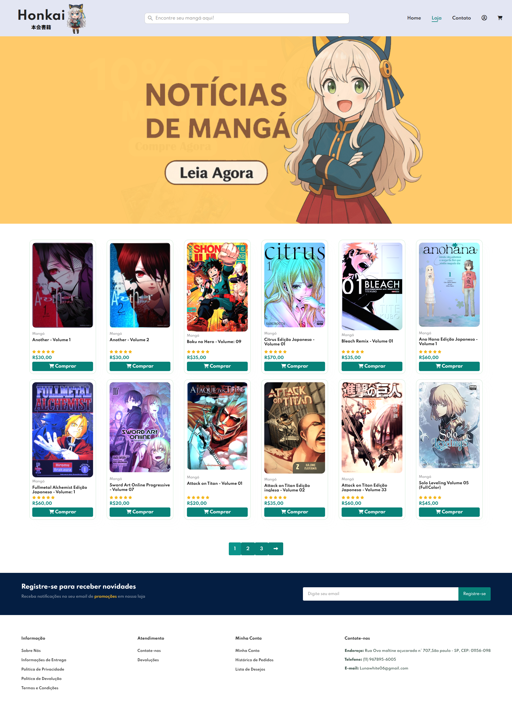
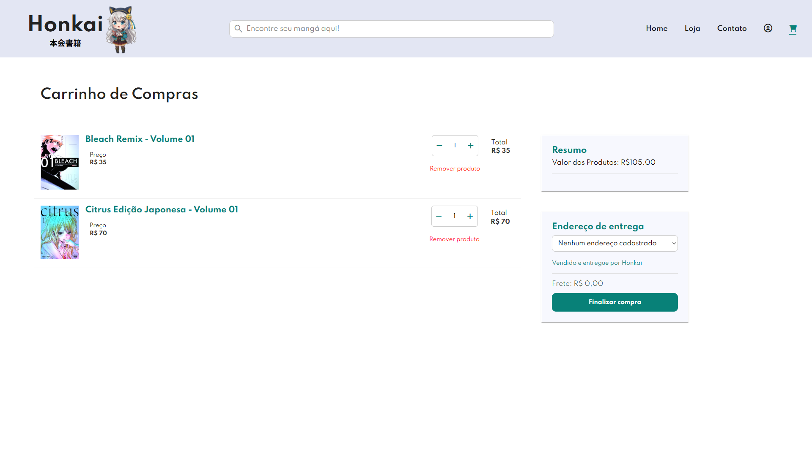
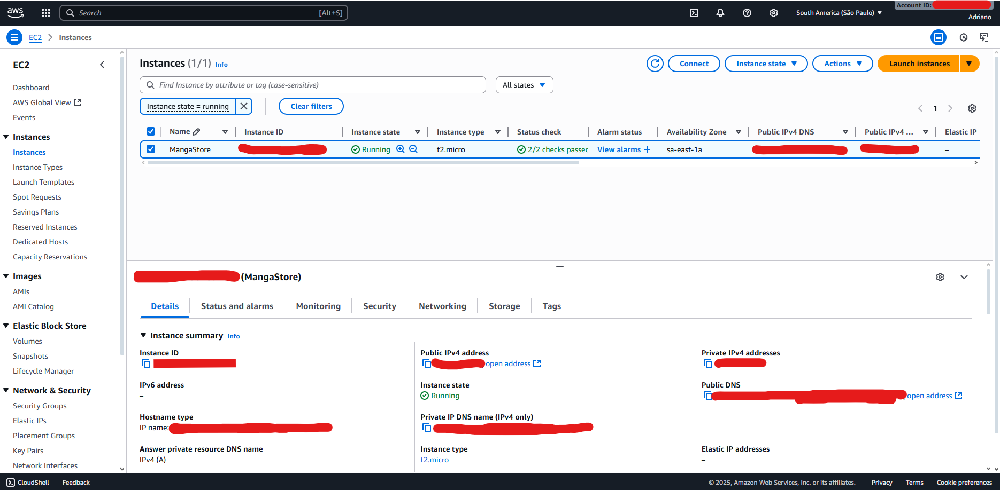

# Honkai Store 📚🛒

 <!-- Substitua pelo seu banner real -->

## Descrição ✨

**Honkai Store** é uma plataforma web dinâmica criada para exibir e gerenciar produtos de manga.  
Ela integra um ERP totalmente funcional (**Dolibarr**) como banco de dados, permitindo que produtos adicionados no Dolibarr apareçam automaticamente no site.  

O projeto combina **desenvolvimento frontend** (HTML, CSS e JavaScript) e **backend** (PHP + banco de dados Dolibarr + integração com API do Mercado Pago), mostrando toda a lógica de exibição, gerenciamento e processamento de pagamentos de forma integrada.  

Este projeto foi desenvolvido como trabalho universitário, implantado em um **servidor Linux AWS EC2** com **Nginx**, **HTTPS** e certificados SSL gratuitos via **DuckDNS** e **Certbot**. 🚀

---

## Funcionalidades ⭐

- ✅ Exibição dinâmica de produtos do ERP Dolibarr  
- ✅ Estoque reorganizado automaticamente após cada compra 📦  
- ✅ Busca moderna de produtos, similar a **Dropbox** 🔍  
- ✅ Perfil de usuário com acesso a produtos comprados e edição de dados pessoais 👤  
- ✅ Processamento de pagamentos via API do Mercado Pago 💳  
- ✅ Interface responsiva usando HTML, CSS e JavaScript 📱💻  
- ✅ Acesso e gerenciamento fácil do ERP (Dolibarr) e do banco de dados (via phpMyAdmin)  
- ✅ Implantação com HTTPS e certificados SSL gratuitos 🔒  
- ✅ Todos os dados armazenados totalmente no ERP Dolibarr 💾  
- ✅ Site responsivo e totalmente portátil em dispositivos móveis 📱

---

## Tecnologias Utilizadas 🛠️

- **Backend:** PHP, Composer (PHPMailer, SDK Mercado Pago)  
- **Frontend:** HTML, CSS, JavaScript  
- **Banco de Dados / ERP:** MySQL (Dolibarr)  
- **Servidor / Deploy:** Linux, Nginx, AWS EC2, DuckDNS, Certbot  
- **Integração de Pagamento:** API Mercado Pago (sandbox)

---

## Arquitetura 🏗️

1. **ERP Dolibarr** atua como banco de dados principal, onde produtos e informações são gerenciados.  
2. **Scripts PHP** buscam e exibem dados dinamicamente do Dolibarr.  
3. **Frontend** exibe o catálogo de mangas e lida com as interações do usuário.  
4. **Sistema de pagamento** integra o SDK do Mercado Pago para transações seguras.  
5. **Servidor** implantado na AWS EC2 com Nginx, servindo a aplicação PHP via HTTPS.  

---

## Capturas de Tela 📸

**Página da Loja:**  

**Página do Carrinho:**  

**Deploy na AWS:**  

---

## Como Funciona 💡

- Produtos adicionados ou atualizados diretamente no **ERP Dolibarr** aparecem automaticamente no site.  
- Pagamentos podem ser processados usando o sistema **sandbox do Mercado Pago**.  
- Usuários podem criar perfil, visualizar compras e editar dados pessoais, como endereço.  
- Estoque é reorganizado dinamicamente a cada compra.  

---

## Coisas Para Fazer 🤝

O site ainda não está 100% completo e precisaria de algumas atualizações se fosse utilizado de forma profissional, incluindo:

- [ ] Função para reembolsar produtos
- [ ] Página para mostrar os produtos desejados
- [ ] Criar newsletter
- [ ] Corrigir os links nos banners
- [ ] Conectar a uma transportadora
- [ ] Opção de trocar a senha na tela de login
- [ ] Trocar de sandbox para o formato oficial do Mercado Pago (Dinheiro Real)

---

